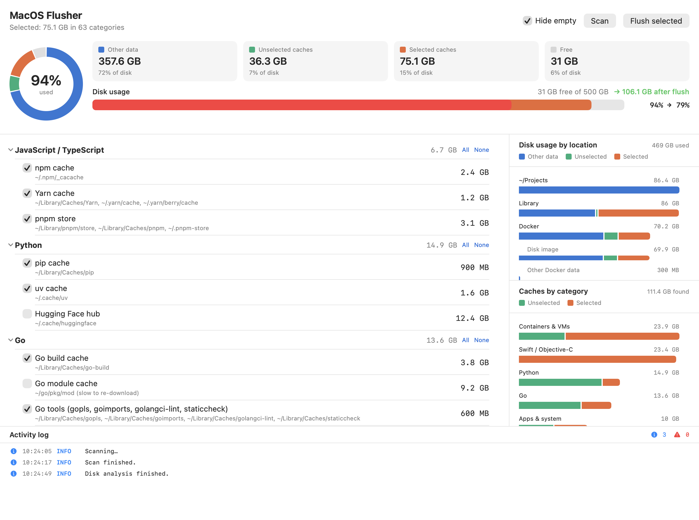

# MacOS Flusher

A small native macOS app that finds and deletes developer caches: package manager and build caches for most programming languages, Docker leftovers, IDE and tool caches, app updater leftovers.

Pick the categories, see how much each one takes, press Flush. The disk bar shows how full the disk is now and how much will be free after the flush.



Website: https://bircex.github.io/macos-flusher/

## Install

Needs macOS 13 or newer. The app is a universal binary for Apple Silicon and Intel.

Download [MacOS-Flusher.dmg](https://github.com/bircex/macos-flusher/releases/latest/download/MacOS-Flusher.dmg) and drag the app into Applications. The app is not notarized, so macOS asks you to allow it the first time. The [install section of the website](https://bircex.github.io/macos-flusher/#install) shows how.

Or install the latest release with one command:

```
curl -fsSL https://raw.githubusercontent.com/bircex/macos-flusher/main/install.sh | bash
```

Or from a clone (needs Xcode Command Line Tools):

```
make install    # builds and copies "MacOS Flusher.app" into /Applications
make run        # builds and opens it without installing
```

## Releases

Versions follow calendar versioning, `YYYY.M.PATCH`, for example `2026.9.0`. The release workflow publishes a new version when a change to the app is merged into `main`. Each release has a DMG, a ZIP and a `SHA256SUMS` file.

## What it covers

- JavaScript: npm, Yarn, pnpm, Bun, Deno, Corepack, nvm, node-gyp, Electron, Turborepo
- Python: pip, uv, Poetry, Pipenv, pipx, Conda, Ruff, pre-commit, Hugging Face, PyTorch hub
- Go: build cache, module cache, gopls / goimports / golangci-lint / staticcheck
- Rust: Cargo registry and git, rustup downloads, sccache
- JVM: Gradle, Maven, Coursier / sbt / Ivy, Kotlin, Android, Bazel
- .NET: NuGet packages and HTTP cache
- Swift / Objective-C: Xcode DerivedData, iOS DeviceSupport, Simulator, Swift PM, CocoaPods, Carthage
- Ruby, PHP, Perl, Lua: RubyGems / Bundler, Composer, CPAN, LuaRocks
- Elixir, Erlang, Haskell, OCaml: Hex / Mix, rebar3, Cabal, Stack, opam
- C / C++: ccache, Conan, vcpkg
- Dart / Flutter, Zig, Nim, Julia, R, Crystal, D
- Containers and VMs: Docker build cache, dangling and unused images, anonymous volumes, stopped containers, Podman, minikube, Vagrant, Lima / Colima
- IDEs and tools: Homebrew, JetBrains, VS Code, Cursor, Playwright, Cypress, Puppeteer, Terraform, Pulumi, Helm, AWS CLI, Ollama, Claude Code, Codex
- Apps and system: app updater leftovers, Spotify, Slack, browser caches, user logs, Trash

Items whose tool is not installed are greyed out. Caches that are slow to rebuild or hold user data (Go module cache, Maven, Hugging Face models, Ollama models, Trash, logs, stopped containers) are off by default. Named Docker volumes are never removed.

## How it works

Sizes come from `du` for directories and from the tool's own reporting for Docker. Deleting is either removing the directory contents or running the tool's own cleanup command (`go clean -cache`, `npm cache clean`, `docker builder prune`, `brew cleanup`). All work runs off the main thread; the UI never blocks and a scan or flush can be stopped.

Adding a category is one line in `Sources/MacOSFlusher/Catalog.swift`. The app icon is generated by `make icon` from `Tools/make-icon.swift`.

## License

MIT
